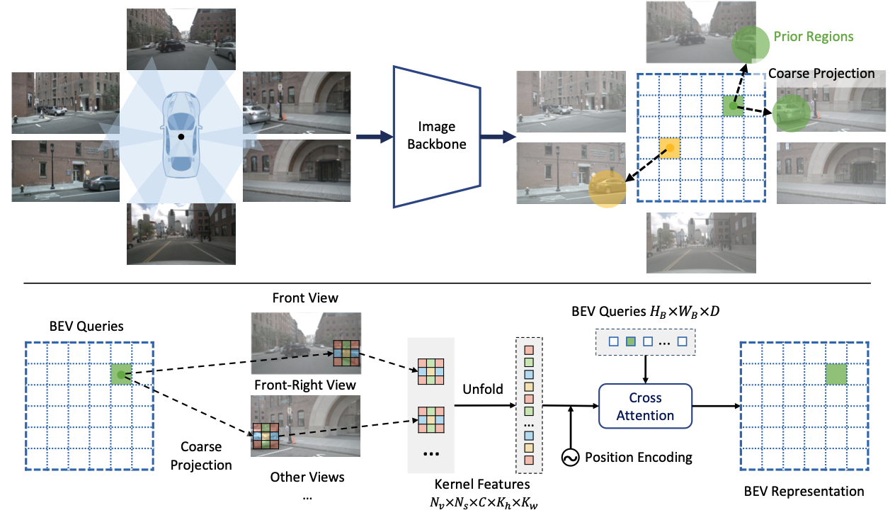

<div align="center">
<h1> Geometry-guided Kernel Transformer </h1>
<span><font size="5", > Efficient and Robust 2D-to-BEV Representation Learning via Geometry-guided Kernel Transformer
 </font></span>
</br>
Shaoyu Chen*, Tianheng Cheng*, <a href="https://xinggangw.info/">Xinggang Wang</a><sup><span>&#8224;</span></sup>, Wenming Meng, <a href="https://scholar.google.com/citations?user=pCY-bikAAAAJ&hl=zh-CN">Qian Zhang</a>, <a href="http://eic.hust.edu.cn/professor/liuwenyu/"> Wenyu Liu</a>

(<span>*</span>: equal contribution, <span>&#8224;</span>: corresponding author)
<br>
<div><a href="https://arxiv.org/pdf/2206.04584.pdf">[arXiv Preprint]</a></div> 

</div>

## News

* `October 14, 2022`: We've released code & models for map-view  segmentation

* `June 9, 2022`: We've released the tech report for Geometry-guided Kernel Transformer (GKT). This work is still in progress and code/models are coming sonn. Please stay tuned! ☕️

## Introduction



We present a novel and efficient **2D-to-BEV** transformation, Geometry-guided Kernel Transformer (GKT).

* GKT leverages geometric priors to guide the transformers to focus on discriminative regions for generating BEV representation with surrouding-view image features.
* GKT is based on kernel-wise attention and much efficient, especially with LUT indexing.
* GKT is robust to the deviation of cameras, making the 2D-to-BEV transformation more stable and reliable.


## Getting Started

````bash
git clone https://github.com/hustvl/GKT.git
````

## Map-view nuScenes Segmentation

### Models

| Method | Kernel | mIoU (Setting 1) | mIoU (Setting 2) | FPS | model |
| :----: | :----: | :--------------: | :--------------: | :-: | :---: |
| [CVT](https://github.com/bradyz/cross_view_transformers) | - | 39.3 | 37.2 | 34.1 | [model]() |
| GKT    | 7x1 | 41.4 | 38.0 | 45.6 | [model](https://drive.google.com/file/d/1w51wMi7IBFRT62urQB5iqyt5QxuZoPI7/view?usp=sharing) |

Note: FPS are measured on one 2080 Ti GPU.

### Usage

For map-view nuScenes segmentation, we mainly build the GKT based on the awesome [CrossViewTransformer](https://github.com/bradyz/cross_view_transformers).

```bash
# map-view segmentation
cd segmentation
```

#### Prerequisites

```bash
# install dependencies
pip install -r reuqirements.txt
pip install -e .
```

#### Preparing the Dataset

* [Dataset setup](segmentation/docs/dataset_setup.md)
* [Label generation](segmentation/docs/label_generation.md) 

#### Training / Testing / Benchmarking

* Pretrained model

Download the pretrained model [efficientnet-b4-6ed6700e.pth](https://drive.google.com/file/d/1WyVwxykkh3jlSW8HiT3NKtJjISBsUaiq/view?usp=sharing)

```
mkdir pretrained_models
cd pretrained_models
# place the pretrained model here
```

* Training

```bash
python scripts/train.py +experiment=gkt_nuscenes_vehicle_kernel_7x1.yaml  data.dataset_dir=<path/to/nuScenes> data.labels_dir=<path/to/labels>
```

* Testing

Using the absolute path of the checkpoint is better.

```bash
python scripts/eval.py +experiment=gkt_nuscenes_vehicle_kernel_7x1.yaml data.dataset_dir=<path/to/nuScenes> data.labels_dir=<path/to/labels> experiment.ckptt <path/to/checkpoint>
```


* Evalutating Speed

```bash
python scripts/speed.py +experiment=gkt_nuscenes_vehicle_kernel_7x1.yaml data.dataset_dir=<path/to/nuScenes> data.labels_dir=<path/to/labels>
```


## 3D Object Detection

coming soon.


## Acknowledgements

We sincerely appreciate the awesome repos [cross_view_transformers](https://github.com/bradyz/cross_view_transformers) and [fiery](https://github.com/wayveai/fiery)!

## License

GKT is released under the [MIT Licence](LICENSE).

## Citation

If you find GKT is useful in your research or applications, please consider giving us a star &#127775; and citing it by the following BibTeX entry.

```bibtex
@article{GeokernelTransformer,
  title={Efficient and Robust 2D-to-BEV Representation Learning via Geometry-guided Kernel Transformer},
  author={Chen, Shaoyu and Cheng, Tianheng and Wang, Xinggang and Meng, Wenming and Zhang, Qian and Liu, Wenyu},
  journal={arXiv preprint arXiv:2206.04584},
  year={2022}
}
```
